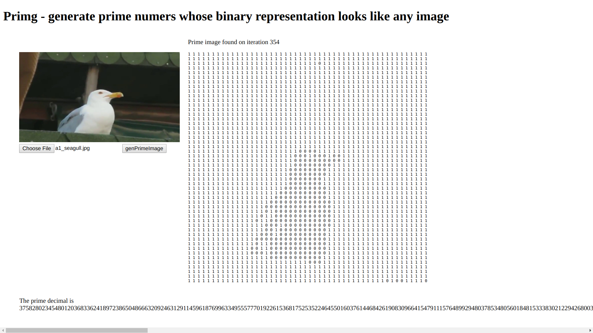

# primg

Inspired by this: [Does there exist a prime number whose representation on a phone screen looks like a giraffe?](https://www.reddit.com/r/math/comments/7qpfls/does_there_exist_a_prime_number_whose/?st=jcwjmz50&sh=1dfbb1b2)

Access it here https://geonnave.github.io/primg/.

I think it would be nice to have that as a general service on the Internet.

# ToDo

- make it faster (currently takes minutes)
- find a way to update the DOM while doing heavy processing
- make it prettier
- make code cleaner
