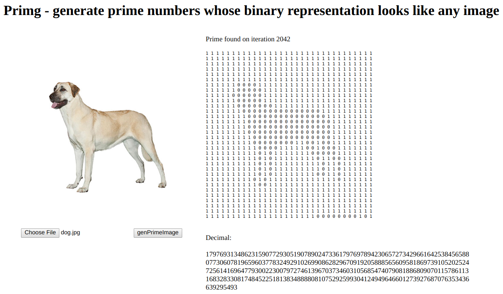

# primg

Inspired by this: [Does there exist a prime number whose representation on a phone screen looks like a giraffe?](https://www.reddit.com/r/math/comments/7qpfls/does_there_exist_a_prime_number_whose/?st=jcwjmz50&sh=1dfbb1b2)

Access it here https://geonnave.github.io/primg/.

Primg [has made it to Hacker News' front page](https://news.ycombinator.com/item?id=16260512)! :)

**Update**: now you can share URLs by appending the decimal number after the hash on the URL (you lose the image tough). For example, this is a prime dog: https://geonnave.github.io/primg/#179769313486231590772930519078902473361797697894230657273429661642538456588077306078196596037783249291026990862829670919205888565609581869739105202524725614169647793002230079727461396703734603105685474079081886809070115786113168328330817484522518138348888081075292599304124949646601273927687076353436639295493. Thanks for jchavannes and fovc from Hacker News for sharing ideas on this feature.

# ToDo

- [x] ~~find a way to update the DOM while doing heavy processing~~ solved: Web Workers to the rescue
- [x] ~~use a more clever way (maybe histograms stuff) to find the threshold number~~ now using average of image
- [x] ~~make it faster (currently takes minutes)~~ "solved" by reducing canvas size from 50x50 to 32x32
- [X] make it prettier
- [ ] make code cleaner
